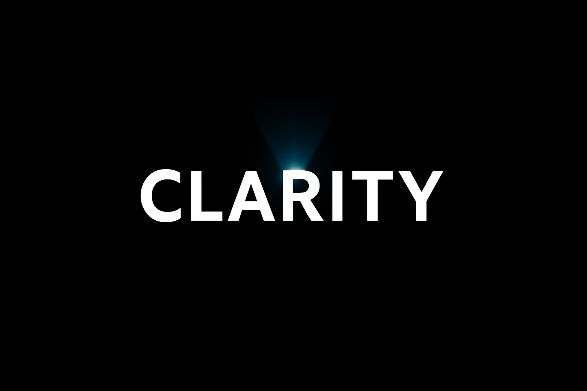

# Clarity Tools Lab - Official Website



**Smarter tools for a clearer life**

Official website for Clarity Tools Lab, showcasing AI-powered productivity tools built with precision, privacy, and purpose.

## 🌐 Live Website

Visit: [claritytoolslab.github.io/clarity-tools-website](https://claritytoolslab.github.io/clarity-tools-website)

## 🚀 Products

### TapVoice AI
Ultra-fast AI voice assistant for Apple Watch with 5-7 second response times.

**Features:**
- ⚡ Lightning-fast responses (5-7s)
- 🌍 9 language support
- 🎙️ Premium OpenAI voice synthesis
- 🔒 Privacy-first design
- 👨‍👩‍👧‍👦 Family sharing included

**Status:** Available Now
**Pricing:** From €2.99/month (10 free questions to start)

### Snap2Plan
AI-powered event and reminder extraction from text and images.

**Features:**
- 📸 Advanced OCR with Apple Vision
- 🤖 GPT-powered intelligent parsing
- 📅 Seamless Calendar integration
- ✅ Auto-save to Apple Reminders

**Status:** Coming Soon

## 🎨 Design Philosophy

**Brand Colors:**
- Primary: Black (#000000)
- Secondary: White (#FFFFFF)
- Accent: Blue (#0066ff)

**Principles:**
- 🎯 **Clarity** - Simplicity in design, power in functionality
- 🔒 **Privacy** - Your data stays yours, always
- ⚡ **Speed** - Fast, responsive, and reliable tools

## 🛠️ Tech Stack

- **HTML5** - Semantic markup
- **CSS3** - Modern responsive design with CSS Grid & Flexbox
- **Vanilla JavaScript** - No dependencies, pure performance
- **GitHub Pages** - Fast, secure hosting

## 📁 Project Structure

```
clarity-tools-website/
├── index.html          # Main HTML file
├── css/
│   └── style.css      # Main stylesheet
├── js/
│   └── main.js        # Interactive features
├── images/
│   ├── hero-banner.png
│   ├── logo.png
│   └── logo-square.png
├── assets/            # Additional resources
└── README.md
```

## ✨ Features

- ✅ Fully responsive (mobile, tablet, desktop)
- ✅ Accessibility optimized (WCAG 2.1)
- ✅ SEO friendly with meta tags
- ✅ Performance optimized
- ✅ Smooth scroll animations
- ✅ Mobile navigation
- ✅ Dark theme by default
- ✅ No external dependencies

## 🚀 Local Development

1. Clone the repository:
```bash
git clone https://github.com/claritytoolslab/clarity-tools-website.git
cd clarity-tools-website
```

2. Open in browser:
```bash
open index.html
# or
python3 -m http.server 8000
```

3. View at `http://localhost:8000`

## 📦 Deployment

This site is automatically deployed to GitHub Pages when changes are pushed to the main branch.

### Setup GitHub Pages:
1. Go to repository Settings
2. Navigate to Pages section
3. Set source to "main" branch
4. Save and wait for deployment

## 🎯 Methodology & Inspiration

Built with inspiration from:
- **Getting Things Done (GTD)** - Organized workflow
- **Bullet Journaling** - Clear structure
- **Atomic Habits** - Small improvements, big impact

## 📧 Contact

- **Email:** [tapvoiceai@gmail.com](mailto:tapvoiceai@gmail.com)
- **GitHub:** [@claritytoolslab](https://github.com/claritytoolslab)
- **Location:** Finland 🇫🇮

## 🔗 Related Projects

- [TapVoice Privacy Policy](https://github.com/claritytoolslab/tapvoice-privacy)
- [Clarity Events AI Legal](https://github.com/claritytoolslab/clarity-events-ai-legal)
- [TapVoice Feedback](https://github.com/claritytoolslab/tapvoice-feedback)

## 📄 License

© 2025 Clarity Tools Lab. All rights reserved.

## 🙏 Credits

- **Design & Development:** Miika Kettunen
- **Philosophy:** Professional, privacy-first, user-focused
- **Built with:** HTML5, CSS3, JavaScript, and clarity in mind

---

**Smarter tools for a clearer life** ✨
